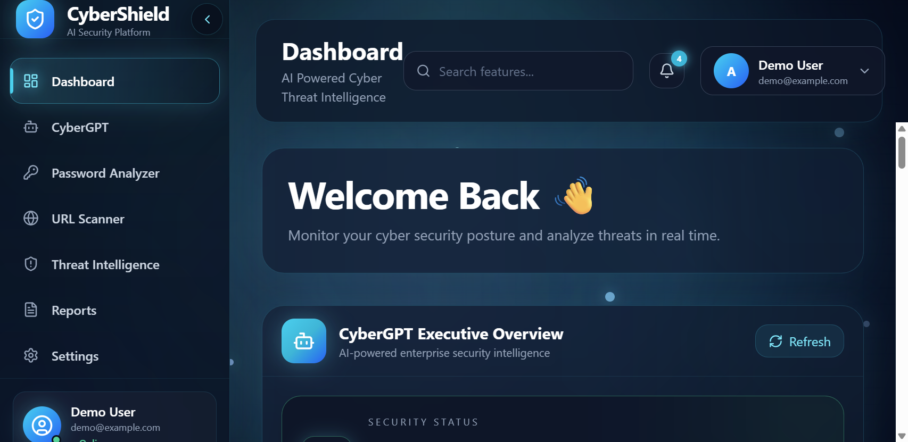
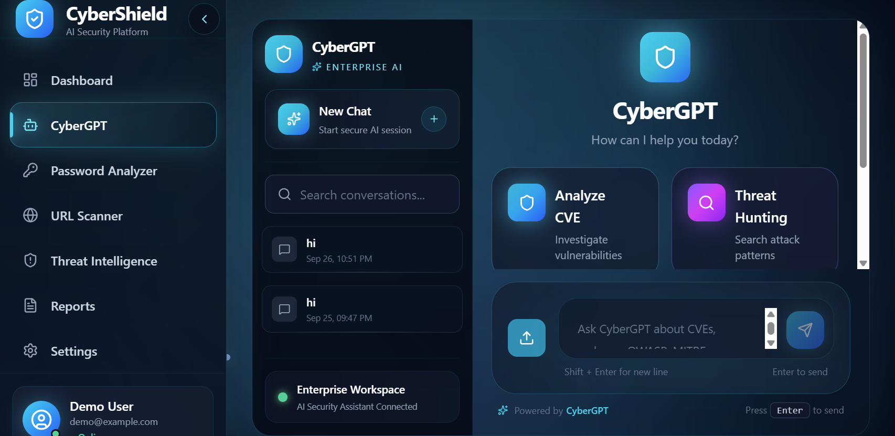
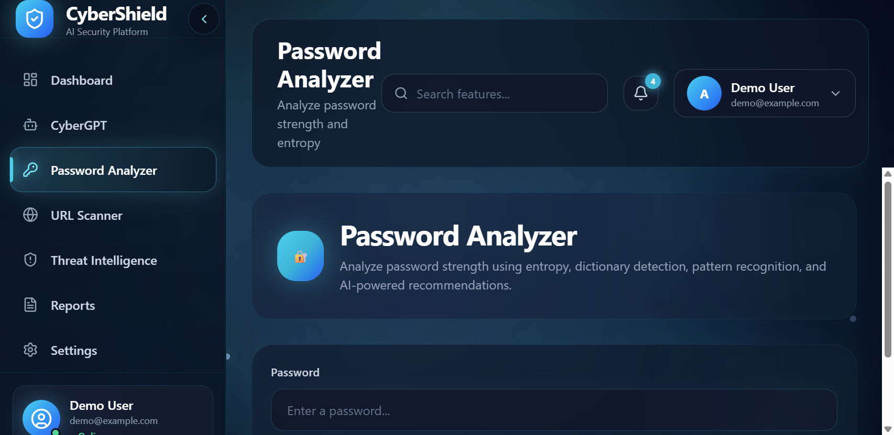
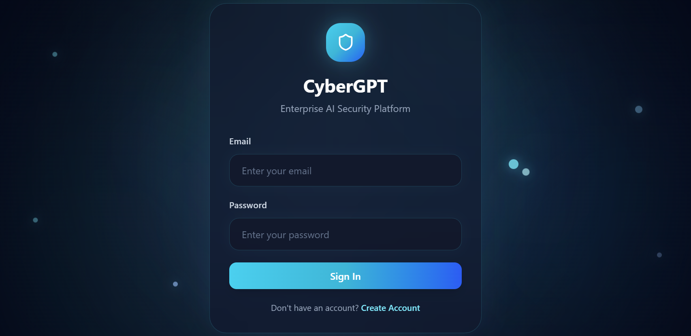
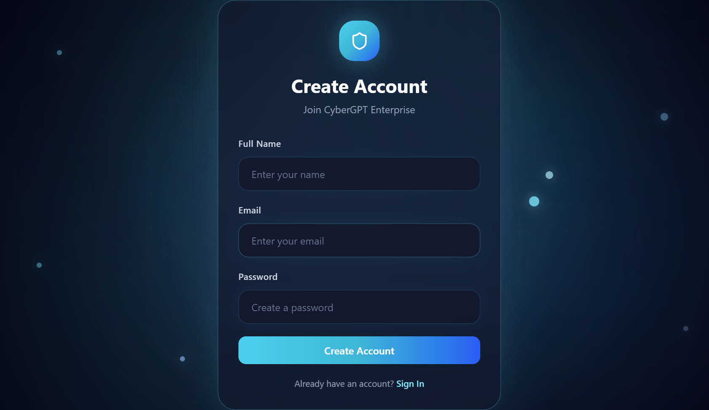
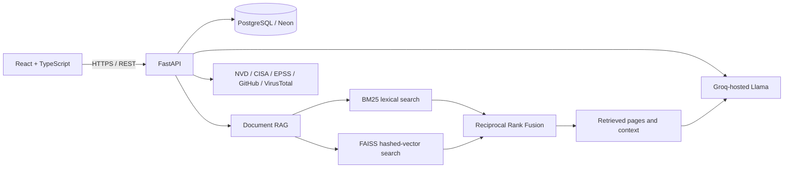

# CyberShield AI

**An AI-assisted cybersecurity workspace for security-document Q&A, vulnerability research, URL triage, and password analysis.**

[Live application](https://cybershieldai-security.vercel.app/login) | [API health](https://cybershield-backend-oz7p.onrender.com/health) | [API docs](https://cybershield-backend-oz7p.onrender.com/docs) | [Deployment guide](docs/DEPLOYMENT.md) | [RAG evaluation](backend/evaluation/README.md)

CyberShield AI brings common security research workflows into one web application. Users can ask questions against security references, inspect CVE intelligence, assess suspicious URLs, and analyze password strength. It is a portfolio project and decision-support tool, not a replacement for security review or incident-response procedures.

## Screenshots

| Dashboard | CyberGPT | Password Analyzer |
| --- | --- | --- |
|  |  |  |

| Sign in | Create account |
| --- | --- |
|  |  |

## What It Does

- **CyberGPT:** Answers cybersecurity questions using retrieved document passages, keeps conversation history, and returns source references.
- **Document intelligence:** Accepts PDF, DOCX, and TXT documents; supports question answering, summaries, and comparisons.
- **Threat intelligence:** Enriches CVE lookups with data from NVD, CISA KEV, EPSS, and GitHub advisories, then generates summaries and recommendations.
- **URL scanner:** Combines local URL-risk heuristics with VirusTotal reputation results when configured.
- **Password analyzer:** Scores passwords using length, entropy, dictionary-word, and pattern checks; generates recommendations.
- **Dashboard and reports:** Presents account activity and security scan results.

## Architecture



The frontend is a React, TypeScript, and Vite single-page application. FastAPI exposes REST endpoints and uses SQLAlchemy with PostgreSQL for application data. The hosted deployment uses Vercel for the frontend, Render for the backend, and Neon for PostgreSQL.

### AI and Retrieval

The default hosted model is **Llama 3.1 8B Instant through Groq's OpenAI-compatible API**. The backend does not download model weights.

For document retrieval, the application extracts text, chunks it at 800 characters with 150-character overlap, and preserves source/page metadata. It combines:

- BM25 keyword retrieval.
- A deterministic, normalized 384-dimensional feature-hashing representation searched with FAISS L2. This is **not** a pretrained semantic embedding model.
- Reciprocal Rank Fusion, a query-term coverage adjustment, duplicate-page removal, and up to five returned passages.

The six bundled public references are OWASP Top 10, OWASP ASVS 5.0, NIST CSF 2.0, NIST SP 800-53 Rev. 5, NIST SP 800-61r3, and NIST SP 800-207. The current evaluation index contains 3,662 chunks from those references.

## Evaluation

An 18-question, manually page-labeled benchmark compares the retrieval methods over the six public references. Metrics are macro averages; a hit means the exact labeled source page was returned in the top five.

| Method | Recall@5 | MRR | nDCG@5 |
| --- | ---: | ---: | ---: |
| BM25 | 66.67% | 0.4648 | 0.5155 |
| Feature-hashed vectors | 38.89% | 0.1963 | 0.2433 |
| Hybrid BM25 + FAISS + RRF | **72.22%** | **0.4713** | **0.5314** |

These are **small internal retrieval-benchmark results**, not answer accuracy or a general quality guarantee. The URL heuristic was separately checked on 24 synthetic fixtures: accuracy 87.50%, precision 100%, recall 75%, and F1 85.71%. That fixture set is not a real-world phishing dataset, and the measurement excludes VirusTotal. Generated-answer citation correctness and faithfulness still require manual review.

See [the evaluation guide](backend/evaluation/README.md) for the methodology, per-question rankings, datasets, and rerun command. Results are saved in [backend/evaluation/results.json](backend/evaluation/results.json).

## Technology

| Area | Technologies |
| --- | --- |
| Frontend | React, TypeScript, Vite, Tailwind CSS, Axios, Recharts |
| API and services | Python, FastAPI, Pydantic, SQLAlchemy |
| Persistence | PostgreSQL; Neon in the hosted deployment |
| Retrieval | FAISS, BM25, feature hashing, Reciprocal Rank Fusion |
| Hosted inference | Groq API, Llama 3.1 8B Instant |
| Security data | NVD, CISA KEV, EPSS, GitHub advisories, VirusTotal |
| Deployment | Vercel, Render, Neon, Docker, Docker Compose, Nginx |

## Run Locally

Requirements: Git, Docker Desktop, and a Groq API key for AI responses.

```bash
git clone https://github.com/MoAftab-01/CyberShield-AI.git
cd CyberShield-AI
```

Create the backend environment file:

```powershell
Copy-Item backend\.env.example backend\.env
```

On macOS/Linux, use `cp backend/.env.example backend/.env`. Set `GROQ_API_KEY` and replace `JWT_SECRET` in `backend/.env`, then start the services:

```bash
docker compose up --build
```

Open the frontend at `http://localhost` and the API documentation at `http://localhost:8000/docs`. The Compose setup provides PostgreSQL, backend, and Nginx-served frontend. Never commit `.env` files or real credentials.

## Hosted Deployment

- **Frontend:** [Vercel](https://cybershieldai-security.vercel.app/login)
- **Backend:** [Render API](https://cybershield-backend-oz7p.onrender.com/), with [health check](https://cybershield-backend-oz7p.onrender.com/health) and [interactive API docs](https://cybershield-backend-oz7p.onrender.com/docs)
- **Database:** Neon PostgreSQL
- **LLM:** Groq-hosted Llama

The Render free service may sleep when idle, so the first request can be delayed. Its local filesystem is ephemeral: do not rely on it to preserve user uploads or generated indexes across restarts. Use persistent/object storage for durable files. See [docs/DEPLOYMENT.md](docs/DEPLOYMENT.md) for build settings and environment-variable setup.

## Current Limitations

- Retrieval evaluation is a small, manually labeled benchmark and should be expanded and independently reviewed before making broad performance claims.
- URL-detection scores come from synthetic fixtures, not a representative phishing corpus.
- Generated-answer citation correctness and factual faithfulness have not yet been measured.
- The Copilot API currently uses a placeholder user ID; per-user isolation for Copilot conversations and uploaded documents needs to be completed before handling sensitive data.
- Free-tier hosting can sleep and does not provide durable local upload storage.

## Repository Guide

| Path | Contents |
| --- | --- |
| `frontend/` | React application and Vercel configuration |
| `backend/app/` | FastAPI routes, services, agents, integrations, and retrieval code |
| `backend/knowledge_base/` | Bundled security-reference PDFs |
| `backend/evaluation/` | Curated benchmark cases, result report, and annotation template |
| `docs/` | Deployment and architecture documentation |

Licensed under the terms in [LICENSE](LICENSE).
